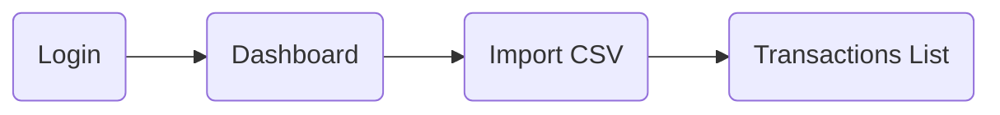

# JOURNEY MAP

## Flow: Slice 1 (MVP)

### Login
- Where implemented: `src/app/(auth)/login/page.tsx`.
- Key UI elements: AuthForm, OAuth buttons, errors.
- Navigation rules: success → `/dashboard`, failure → remain on login.

### Dashboard
- Where implemented: `src/app/(app)/dashboard/page.tsx`.
- Key UI elements: summary cards, “Importar CSV” CTA.
- Navigation rules: CTA → `/import` and `/transactions`.

### Import CSV
- Where implemented: `src/app/(app)/import/page.tsx`.
- Key UI elements: upload input, preview table, confirm button, summary card.
- Navigation rules: success → `/transactions`, reset → stay on `/import`.

### Transactions List
- Where implemented: `src/app/(app)/transactions/page.tsx`.
- Key UI elements: search box, list items, empty-state CTA.
- Navigation rules: CTA → `/import`.
